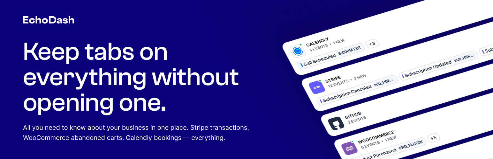

[](https://echodash.com)

# EchoDash for WordPress

Track user events and interactions across your WordPress site with EchoDash analytics. Built for developers and site owners who need detailed insights into user behavior across multiple WordPress plugins.

## Features

- 🔌 **Plugin Integrations**: Ready-made tracking for popular WordPress plugins
- 🚀 **Performance Focused**: Non-blocking API calls and minimal overhead
- 🛠 **Developer Friendly**: Extensible architecture for custom integrations
- 🎯 **Flexible Events**: Track any data point with customizable event properties
- 🔄 **Real-time Updates**: Events appear instantly in your EchoDash dashboard
- 🔒 **Secure**: All data is transmitted over HTTPS

## Requirements

- WordPress 6.0+
- PHP 7.4+

## Installation

1. Download the latest release from [GitHub Releases](../../releases/latest)
2. Upload to wp-content/plugins/
3. Activate through WordPress admin
4. Connect to EchoDash in Settings → EchoDash

## Creating Custom Integrations

### 1. Basic Integration Structure

Create a new file in `includes/integrations/your-integration/class-echodash-your-integration.php`:

```php
class EchoDash_Your_Integration extends EchoDash_Integration {
    
    public $slug = 'your-integration';
    public $name = 'Your Integration Name';

    public function init() {
        // Add your action/filter hooks here
        add_action( 'your_plugin_event', array( $this, 'handle_event' ) );
    }

    protected function setup_triggers() {
        return array(
            'event_happened' => array(
                'name'               => __( 'Event Happened', 'echodash' ),
                'description'        => __( 'Triggered when your event occurs.', 'echodash' ),
                'has_global'         => true, // Show in global settings
                'has_single'         => true, // Show on individual posts/items
                'post_types'         => array( 'post', 'your-cpt' ),
                'option_types'       => array( 'user', 'your_data' ),
                'enabled_by_default' => true,
                'default_event'      => array(
                    'name'     => 'Your Event',
                    'mappings' => array(
                        'user_email' => '{user:user_email}',
                        'item_name'  => '{your_data:name}',
                    ),
                ),
            ),
        );
    }

    public function handle_event( $event_data ) {
        $this->track_event(
            'event_happened',
            array(
                'user'      => get_current_user_id(),
                'your_data' => $event_data->id,
            )
        );
    }
}

new EchoDash_Your_Integration();
```

### 2. Adding Custom Data Sources

Define what data is available for event tracking:

```php
public function get_your_data_options() {
    return array(
        'name'    => __( 'Your Data', 'echodash' ),
        'type'    => 'your_data',
        'options' => array(
            array(
                'meta'        => 'name',
                'preview'     => 'Example Name',
                'placeholder' => __( 'The item name', 'echodash' ),
            ),
            array(
                'meta'        => 'value',
                'preview'     => '100',
                'placeholder' => __( 'The item value', 'echodash' ),
            ),
        ),
    );
}

public function get_your_data_vars( $item_id ) {
    $item = get_your_item( $item_id );
    
    return array(
        'your_data' => array(
            'name'  => $item->name,
            'value' => $item->value,
        ),
    );
}
```

### 3. Tracking Events

```php
// Simple event tracking
echodash_track_event( 'event_name', array(
    'key' => 'value',
) );

// Full event tracking with source and trigger
echodash_track_event(
    'purchase_completed',
    array(
        'total' => $order_total,
        'items' => $items,
    ),
    'your-integration',
    'order_completed'
);
```

### 4. Available Hooks

#### Actions

```php
/**
 * Fires when an event is being tracked.
 * 
 * @param string $event_name    The name of the event being tracked
 * @param array  $event_data    The data being sent with the event
 * @param string $source        The integration/source name (e.g., 'WooCommerce')
 * @param string $trigger       The trigger name (e.g., 'order_completed')
 */
do_action( 'echodash_track_event', $event_name, $event_data, $source, $trigger );

// Example usage:
add_action( 'echodash_track_event', function( $event_name, $event_data, $source, $trigger ) {
    // Log events to a file
    if ( 'purchase_completed' === $event_name ) {
        error_log( sprintf(
            'EchoDash Event: %s from %s (%s) with data: %s',
            $event_name,
            $source,
            $trigger,
            wp_json_encode( $event_data )
        ) );
    }
}, 10, 4 );
```

#### Filters

```php
// Modify event data before sending
add_filter( 'echodash_event_data', function( $data, $objects ) {
    return $data;
}, 10, 2 );

// Add custom objects to events
add_filter( 'echodash_event_objects', function( $objects, $trigger ) {
    return $objects;
}, 10, 2 );

// Modify available triggers
add_filter( 'echodash_your-integration_triggers', function( $triggers ) {
    return $triggers;
} );
```

## Contributing

1. Fork the repository
2. Create a feature branch
3. Commit your changes
4. Push to the branch
5. Create a Pull Request

## Support

- Documentation: https://echodash.com/docs/echodash-plugin/
- Support: https://echodash.com/support/
- Issues: [Create a GitHub issue](../../issues/new)

## License

GPL v3 or later